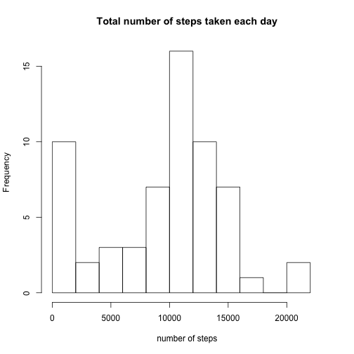
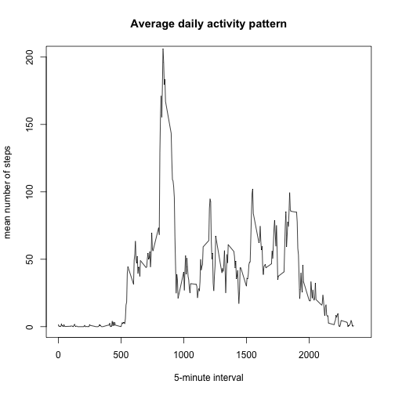
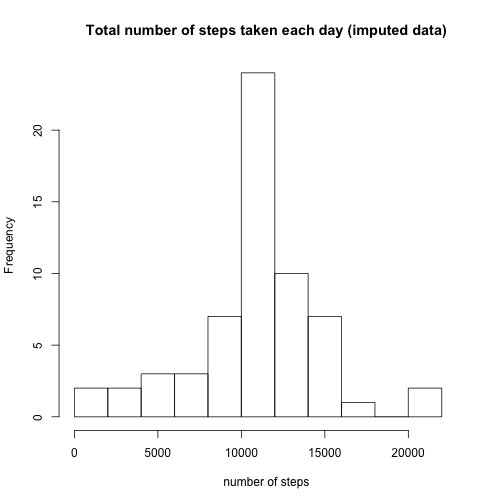
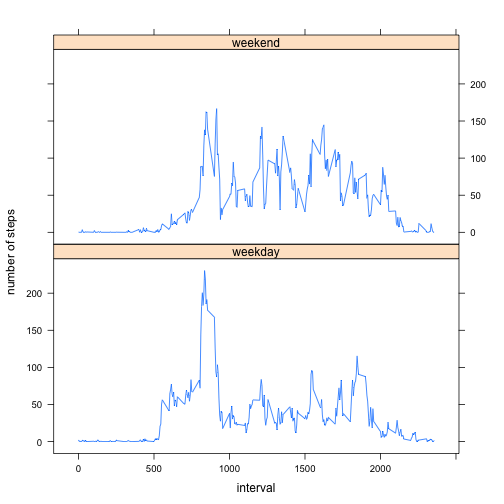

### Loading and preprocessing the data
#### 1. Load the data:

```r
data = read.csv("/Users/ksenia/Downloads/activity.csv", stringsAsFactors=FALSE)
```
#### 2. Process/transform the data:

```r
head(data)
```

```
##   steps       date interval
## 1    NA 2012-10-01        0
## 2    NA 2012-10-01        5
## 3    NA 2012-10-01       10
## 4    NA 2012-10-01       15
## 5    NA 2012-10-01       20
## 6    NA 2012-10-01       25
```

```r
data$date = as.Date(data$date, "%Y-%m-%d")
```

### What is mean total number of steps taken per day?
#### 1. Calculate the total number of steps taken per day
The total number of steps taken per day in October and November is listed below:

```r
steps.sum = aggregate(data$steps, by = list(data$date), FUN = sum, na.rm = TRUE)
steps.sum 
```

```
##       Group.1     x
## 1  2012-10-01     0
## 2  2012-10-02   126
## 3  2012-10-03 11352
## 4  2012-10-04 12116
## 5  2012-10-05 13294
## 6  2012-10-06 15420
## 7  2012-10-07 11015
## 8  2012-10-08     0
## 9  2012-10-09 12811
## 10 2012-10-10  9900
## 11 2012-10-11 10304
## 12 2012-10-12 17382
## 13 2012-10-13 12426
## 14 2012-10-14 15098
## 15 2012-10-15 10139
## 16 2012-10-16 15084
## 17 2012-10-17 13452
## 18 2012-10-18 10056
## 19 2012-10-19 11829
## 20 2012-10-20 10395
## 21 2012-10-21  8821
## 22 2012-10-22 13460
## 23 2012-10-23  8918
## 24 2012-10-24  8355
## 25 2012-10-25  2492
## 26 2012-10-26  6778
## 27 2012-10-27 10119
## 28 2012-10-28 11458
## 29 2012-10-29  5018
## 30 2012-10-30  9819
## 31 2012-10-31 15414
## 32 2012-11-01     0
## 33 2012-11-02 10600
## 34 2012-11-03 10571
## 35 2012-11-04     0
## 36 2012-11-05 10439
## 37 2012-11-06  8334
## 38 2012-11-07 12883
## 39 2012-11-08  3219
## 40 2012-11-09     0
## 41 2012-11-10     0
## 42 2012-11-11 12608
## 43 2012-11-12 10765
## 44 2012-11-13  7336
## 45 2012-11-14     0
## 46 2012-11-15    41
## 47 2012-11-16  5441
## 48 2012-11-17 14339
## 49 2012-11-18 15110
## 50 2012-11-19  8841
## 51 2012-11-20  4472
## 52 2012-11-21 12787
## 53 2012-11-22 20427
## 54 2012-11-23 21194
## 55 2012-11-24 14478
## 56 2012-11-25 11834
## 57 2012-11-26 11162
## 58 2012-11-27 13646
## 59 2012-11-28 10183
## 60 2012-11-29  7047
## 61 2012-11-30     0
```
#### 2. Make a histogram of the total number of steps taken each day:

```r
hist(steps.sum[,2], main = "Total number of steps taken each day", xlab = "number of steps", breaks = 10, xlim = c(0,23000))
```

 

#### 3. Calculate and report the mean and median of the total number of steps taken per day:
The mean number of total steps per day is 9354.23 and the median is 10395.

```r
# here's the mean:
mean(steps.sum[,2])
```

```
## [1] 9354.23
```

```r
# and here's the median:
median(steps.sum[,2])
```

```
## [1] 10395
```

### What is the average daily activity pattern?
#### 1. Make a time series plot:

```r
steps.mean = aggregate(data$steps, by = list(data$interval), FUN = mean, na.rm=TRUE)
names(steps.mean) = c("interval","mean")
plot(steps.mean$interval, steps.mean$mean, type = "l",  main = "Average daily activity pattern", xlab = "5-minute interval", ylab = "mean number of steps", xlim = c(0, 2400), ylim = c(0, 200))
```

 

#### 2. Which 5-minute interval, on average across all the days in the dataset, contains the maximum number of steps?
It is the 8:35 time interval and the max average number of steps across all days is 206.17.

```r
names(steps.mean) = c("interval","mean")
steps.mean[which(steps.mean$mean == max(steps.mean$mean)), ]
```

```
##     interval     mean
## 104      835 206.1698
```

### Imputing missing values
#### 1. Calculate and report the total number of missing values in the dataset
The total number of missing values in the dataset is 2304.

```r
sum(is.na(data))
```

```
## [1] 2304
```

#### 2. Devise a strategy for filling in all of the missing values in the dataset
I will use the the mean for a 5-minute interval to fill in the NA's.

#### 3. Create a new dataset that is equal to the original dataset but with the missing data filled in.

```r
imputed.data = data 
for (i in 1:17568) {
       if (is.na(imputed.data$steps[i])) {
              ind = which(imputed.data$interval[i] == steps.mean$interval)
              imputed.data$steps[i] = steps.mean[ind, ]$mean
       }
}
head(imputed.data)
```

```
##       steps       date interval
## 1 1.7169811 2012-10-01        0
## 2 0.3396226 2012-10-01        5
## 3 0.1320755 2012-10-01       10
## 4 0.1509434 2012-10-01       15
## 5 0.0754717 2012-10-01       20
## 6 2.0943396 2012-10-01       25
```

#### 4. Make a histogram of the total number of steps taken each day and calculate and report the mean and median total number of steps taken per day.
Below is a histogram of the total number of steps with imputed data. The mean and the median total number of steps take per day for the imputed data is 10766.19. It appears that the mean value for the imputed data set is the same as the mean of the original data set. The median for imputed appears to be larger than for original. 

```r
imp.steps.sum = aggregate(imputed.data$steps, by = list(imputed.data$date), FUN = sum)
hist(imp.steps.sum[,2], main = "Total number of steps taken each day (imputed data)", xlab = "number of steps", breaks = 10, xlim = c(0,23000))
```

 

```r
# mean for the imputed data:
mean(imp.steps.sum[,2])
```

```
## [1] 10766.19
```

```r
# median:
median(imp.steps.sum[,2])
```

```
## [1] 10766.19
```

### Are there differences in activity patterns between weekdays and weekends?
#### 1. Create a new factor variable in the dataset with two levels – “weekday” and “weekend” indicating whether a given date is a weekday or weekend day.

```r
library(dplyr)
```

```
## 
## Attaching package: 'dplyr'
## 
## The following objects are masked from 'package:stats':
## 
##     filter, lag
## 
## The following objects are masked from 'package:base':
## 
##     intersect, setdiff, setequal, union
```

```r
imputed.data2 = mutate(imputed.data, dayofweek = weekdays(date))
lut = c("Monday" = "weekday", "Tuesday" = "weekday", "Wednesday" = "weekday", "Thursday" = "weekday", "Friday" = "weekday", "Saturday" = "weekend", "Sunday" = "weekend")
imputed.data2$dayofweek = lut[imputed.data2$dayofweek]
imputed.data2$dayofweek = as.factor(imputed.data2$dayofweek)
levels(imputed.data2$dayofweek)
```

```
## [1] "weekday" "weekend"
```

#### 2. Make a panel plot containing a time series plot

```r
#data prep
impdata2.mean <- aggregate(imputed.data2$steps, 
                       by=list(imputed.data2$dayofweek, imputed.data2$interval), FUN = mean)
names(impdata2.mean) = c("dayofweek", "interval", "steps")
# plotting
library(lattice)
xyplot(steps ~ interval | dayofweek, impdata2.mean, type = "l", xlab = "interval", ylab = "number of steps", layout = c(1, 2))
```

 

